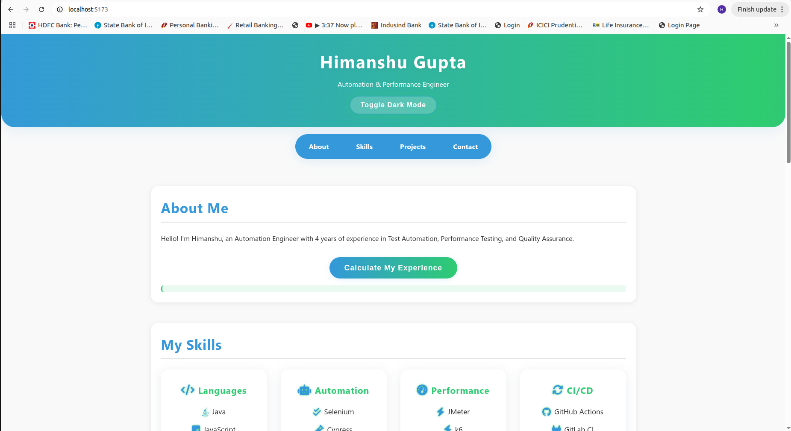
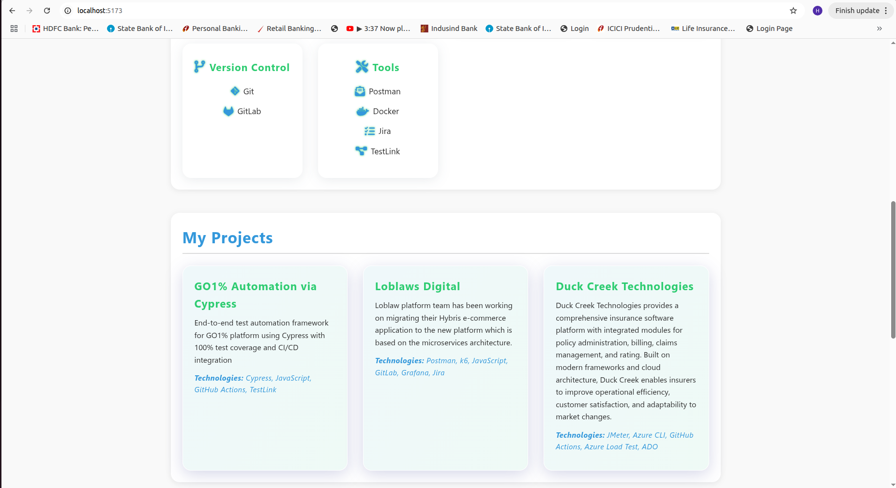
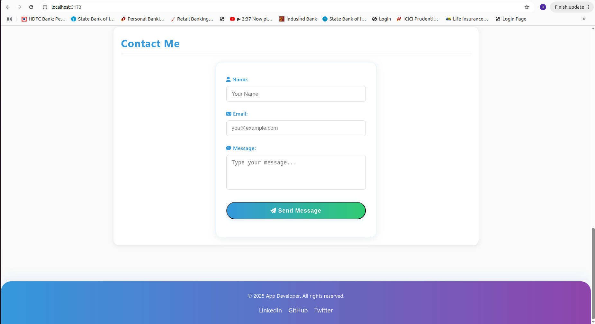

# Himanshu Gupta Portfolio – Day 1 Frontend Bedrock

Welcome to my **modern, interactive portfolio** – built as part of the React Basics Workshop, Day 1!  
This site is a showcase of my skills, projects, and frontend fundamentals, featuring a sleek UI, dark mode, and dynamic content.

---

## Highlights

- 🎨 **Dark/Light Mode Toggle** – Instantly switch themes for any mood
- 🏆 **Animated Gradient Header & Footer** – Eye-catching, modern branding
- 🛠️ **Skills Grid** – Icons and categories, responsive and interactive
- 💼 **Dynamic Projects Section** – Projects rendered from JavaScript, not static HTML
- 📬 **Contact Form** – Live validation, error/success feedback, and beautiful glassmorphism
- 📱 **Fully Responsive** – Looks great on desktop, tablet, and mobile

---

## File Structure

```
.
├── index.html      # Main HTML file (semantic, accessible)
├── styles.css      # All styles, animations, and responsive design
├── script.js       # Interactivity: dark mode, form validation, dynamic projects
└── README.md       # This file
```

---

## How to Use

1. **Clone or Download** this repository.
2. Open `index.html` in your browser.
3. Try toggling dark mode, submitting the contact form, and viewing the projects!

---

## Screenshots

> _Adding screenshots of my site here!_
>
>   
>   
> 

---

## Workshop Requirements Checklist

- [x] Semantic HTML5 structure (`header`, `nav`, `main`, `section`, `footer`)
- [x] Contact form with name, email, message
- [x] External CSS with selectors, box model, Flex/Grid, media queries
- [x] Responsive design
- [x] JavaScript: `let`, `const`, arrow function, template literals, event listeners, classList
- [x] Dark mode toggle
- [x] Contact form validation (with error/success messages)
- [x] Dynamic project rendering from JS array
- [x] "Calculate Experience" button (DOM manipulation)

---

## Credits

- [Font Awesome](https://fontawesome.com/) for icons

---

## 👤 Author

**Himanshu Gupta**  

---
