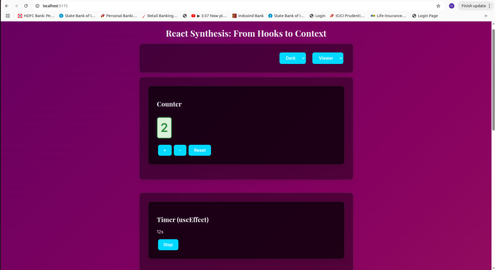
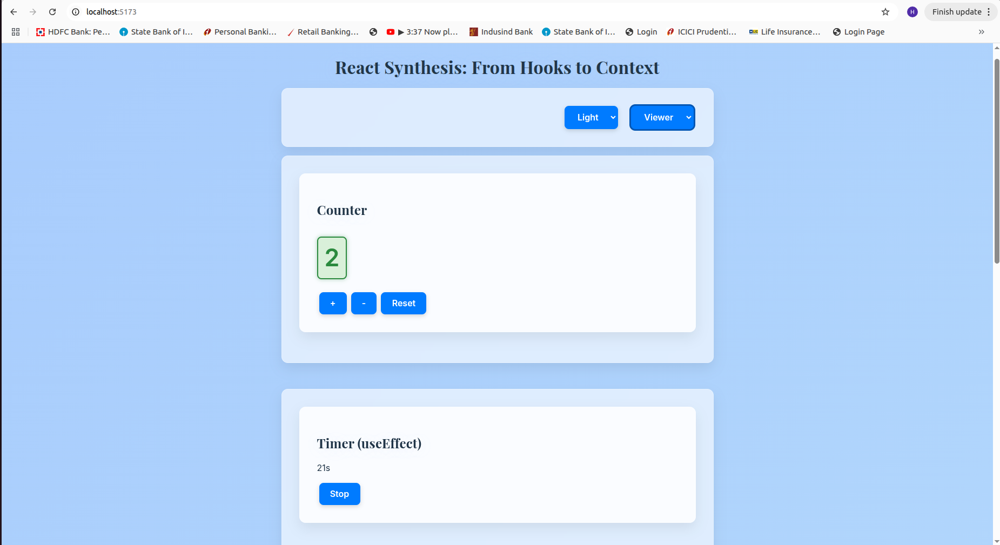

# React Component Workbench - Day 3

### A Hands-On Lab for Modern React Hooks, Context, and TypeScript


This project is a comprehensive exercise for mastering essential and advanced patterns in modern React. It explores the practical application of React Hooks, the Context API for state management, and the power of TypeScript for building robust, scalable, and type-safe components.





---

## 🏁 Getting Started

To run this project locally, follow these steps:

1.  **Clone the repository:**
    ```bash
    git clone https://github.com/HimanshuGupta999/pi-shaped-frontend-Himanshu.git
    cd pi-shaped-frontend-Himanshu
    ```

2.  **Install dependencies:**
    ```bash
    npm install
    ```

3.  **Run the development server:**
    ```bash
    npm run dev
    ```

4.  **Open your browser** and navigate to `http://localhost:5173` (or the port specified by Vite).

---

### **A Look Under the Hood: My Technical Decisions**

This section is a walkthrough of the key technical choices I made while building this project, focusing on how and why I used certain features of React and TypeScript.

#### **1. My Toolkit of Hooks: The "Why" Behind Each Choice**

I used a variety of React Hooks to bring the components to life, each chosen for a specific job.

*   **`useState`**: This was my go-to for pretty much any piece of data that needed to be remembered inside a component. In the `Counter`, it was the obvious choice for tracking the count. In the `AddItemForm`, it kept track of what the user was typing. It’s the bread and butter of state in React.

*   **`useEffect`**: I reached for `useEffect` whenever I needed to interact with the world outside of React's rendering cycle. For the `Timer`, this meant setting up an interval to tick every second when the component first appeared and, just as importantly, clearing that interval when it disappeared to prevent memory leaks. I also used it in the main `App` component to change the theme class on the `<html>` tag itself—a classic side effect.

*   **`useRef`**: In the `InputFocus` component, I needed a way to "reach out" and tell the browser's input field to focus. `useRef` was the perfect tool for this. It gave me a direct, stable reference to the DOM element without causing the component to re-render, so I could simply call `.focus()` on it whenever the button was clicked.

*   **`useMemo`**: The `ExpensiveCalc` component was a perfect demonstration of where `useMemo` shines. The calculation was intentionally slow, and without this hook, it would have dragged the entire app to a halt on every single render. By wrapping it in `useMemo`, I told React, "Only re-run this heavy logic if the number it depends on has *actually* changed." It's a crucial hook for performance optimization.

*   **`useCallback`**: This one is a close cousin to `useMemo`, but for functions. In the `AddItemForm`, I was passing a function down to the `ItemList`. The problem is that React creates a new instance of that function on every render, which would cause the `ItemList` to re-render needlessly. By wrapping the function in `useCallback`, I gave the child component a stable reference, which allowed the `React.memo` optimization on the `ItemList` to work correctly.

*   **`useContext`**: To manage the light/dark theme, I really wanted to avoid "prop drilling"—the messy business of passing props down through multiple layers. `useContext` was the clean solution. I set up a `ThemeContext` once at the top level, and then any component, no matter how deep, could easily "tune in" with the `useContext` hook to get the current theme or the function to change it.

<br/>

#### **2. Making Friends with TypeScript**

Using TypeScript from the start made the entire development process smoother and less error-prone.

##### The Reusable `Dropdown<T>` with Generics

My favorite part of this exercise was building the generic `Dropdown<T>` component. I had a problem: I needed one dropdown to handle a simple list of strings (`'light'`, `'dark'`) and another to handle a more complex list of `UserRole` objects.

Instead of writing two separate components, I built one flexible component using generics. The `<T>` is like a placeholder for whatever data type I want to use. This meant I could write the component logic once and then use it like this:

```tsx
// Here, I'm telling the Dropdown: "T is a string"
<Dropdown<string>
  options={['light', 'dark']}
  // ... onSelect now knows it will receive a string
/>

// And here, "T is a UserRole object"
<Dropdown<UserRole>
  options={userRoles}
  // ... onSelect now knows it will receive a UserRole
/>
```

This approach not only saved me from writing duplicate code but also gave me complete type safety. TypeScript would have immediately caught me if I tried to pass the wrong type of data to either dropdown.

##### Creating a "Data Contract" with Custom Types

While I didn't use a lot of fancy utility types, simply creating my own `UserRole` type was incredibly helpful.

```typescript
// in src/types/index.ts
export type UserRole = {
  label: string;
  value: 'viewer' | 'editor' | 'admin';
};
```

Think of this as creating a "contract" or a "blueprint" for my data. By doing this, I guaranteed that every part of my app that worked with a user role—the array, the dropdown props, the handler function—all agreed on the exact same structure. It made my code self-documenting and eliminated a whole class of potential bugs caused by simple typos or inconsistencies.